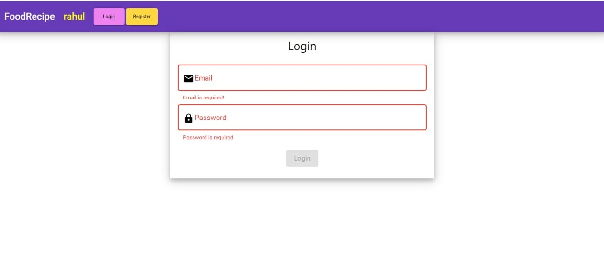
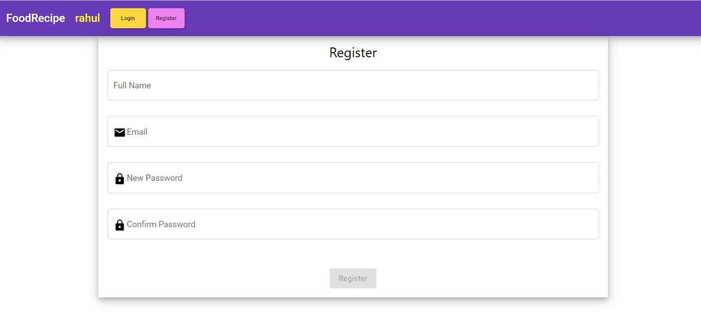
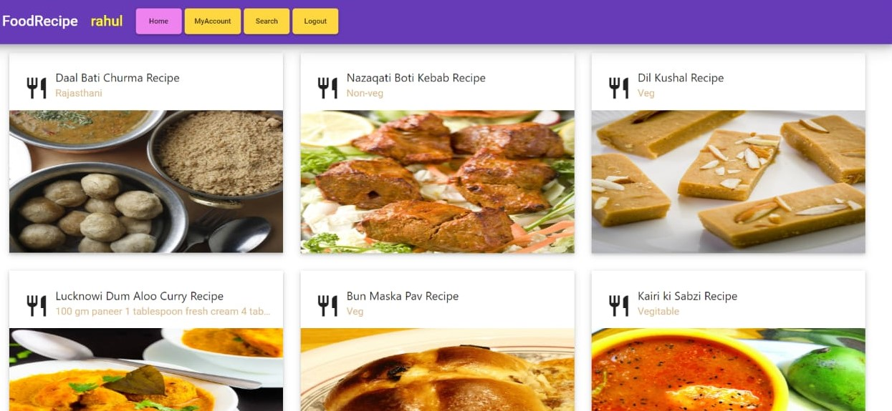
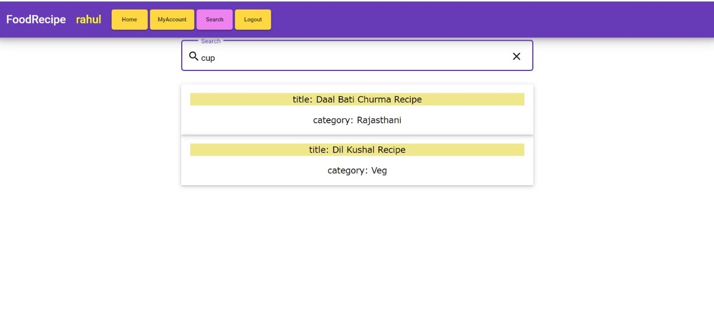

# FoodRecipe

# INTRODUCTION:-
This project was the foodrecipe web app in which user can Login, Register with form validation. 
As well as users can submit their own recipes. 
After submit those recipe can be updated and deleted. 
Recipes can be search using any keywords which can be category or ingrediants or recipe name.

# Require depedencies:-
This project was generated with
## For Frontend
### [Angular CLI]version 8.3.6 (exactly angular cli 8 version)
      'npm i -g @angular/cli@8.3.6'    
### Angular Material Design version 8.2.3
      ‘npm i @angular/material’
### W3 css
      ‘npm i w3-css’

## For Backend
### install on system, nodejs version 10 or above

### install on system, mongoDB version 4

### install on system, Robo 3T version 1.3 or above for mongoDB UI

### install npm package of mongoose version 5.8.11:-
       ‘npm i -g mongoose’      
### install npm package of express version 4.17.1:-
       ‘npm i -g express’     
### install npm package body-parser version 1.19.0:-
       ‘npm i -g body-parser’     
### install npm package nodemon version 2.0.2
       ‘npm i -g nodemon’     

# Screenshots:
## login

## resgister

## home

## my account

## search

# Development server
## To run angular app
Run `ng serve` for a dev server. Navigate to `http://localhost:4200/`. The app will automatically reload if you change any of the source files.

## To run nodejs server 
go to './backend' directory and run on nodejs server
       
       nodemon server.js

# Code scaffolding
Run `ng generate component component-name` to generate a new component. You can also use `ng generate directive|pipe|service|class|guard|interface|enum|module`.

# Build
Run `ng build` to build the project. The build artifacts will be stored in the `dist/` directory. Use the `--prod` flag for a production build.

# test

